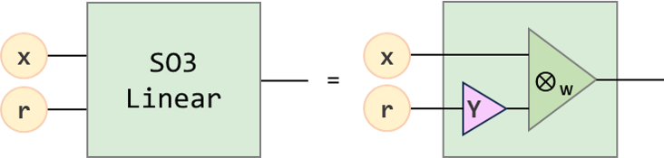
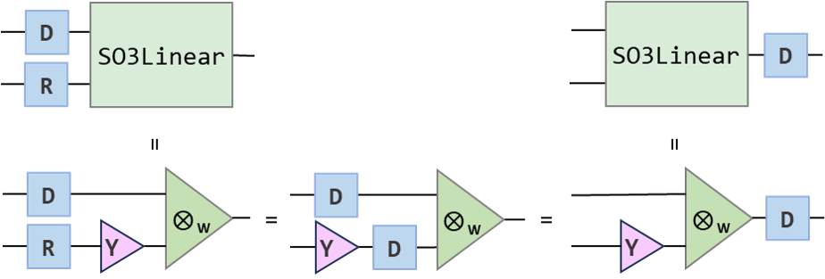
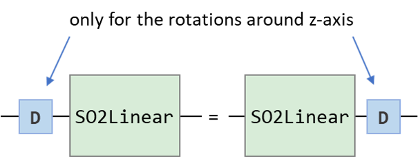
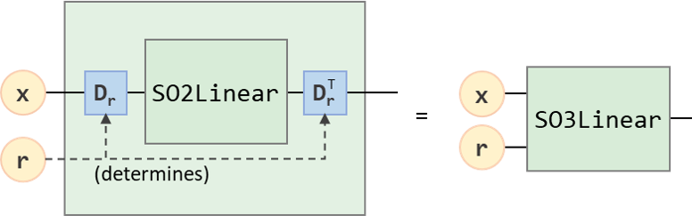

.. _linears:

Equivariant Linear Operations
=============================

Now, it comes to linear operations, which is the essential building block for equivariant neural networks. In this section, we will mainly talk about three kinds of equivariant linear operations: degree-wise linear operation, SO(3) equivariant linear opeartion and SO(2) equivariant linear operation.

Degree-Wise Linear Operation
----------------------------

Degree-wise linear operation just performs the channel mixing on each degrees by

.. math::
    \mathbf{x}'_{c}=\bigoplus_{l}\sum_{c'}\mathbf{W}_{cc'}^{(l)}\mathbf{x}_{c'}^{(l)},

where :math:`\oplus` is the concatenation. 

For simplicity, we will also denote this with :math:`\mathbf{x}'=\tilde{\mathbf{W}}_{\text{DW}}\mathbf{x}`, where the tilde "~" is denoting this is an equivariant function.

In some works, this operation is also called "self-interaction" or simply "linear".

In Equitorch, we can use the :obj:`~equitorch.nn.DegreeWiseLinear`:

.. code-block:: python

    >>> N, C_in, C_out = 3, 6, 7
    >>> L = 5
    >>> x = torch.randn(N, num_orders_in(L), C_in)
    >>> lin = DegreeWiseLinear(L_in=L, L_out=L, in_channels=C_in, out_channels=C_out)
    >>> y = lin(x) # Perform degree-wise linear operation
    >>> print(y.shape)
    torch.Size([3, 36, 7])

We can notice that the degree-wise linear operation do not mix the different orders within a degree, thus, the reader can easily check the equivariance of this operation.

.. code-block:: python

    >>> angles = rand_rotation_angles(N) # Generate N random rotations
    >>> D = wigner_D(L, *angles) # Corresponding Wigner D
    >>> y_rotated = lin(rot_on(D, x)) # Degree-wise linear on rotated inputs

    >>> print(torch.allclose(y_rotated, rot_on(D, y), atol=1e-4)) # Check equivariances
    True
    >>> print((y_rotated-rot_on(D, y)).abs().max())
    tensor(7.1526e-07, grad_fn=<MaxBackward1>)

On the special case where all :math:`\mathbf{W}_{cc'}^{(l)}`'s equal to :math:`\mathbf{W}_{cc'}`, this operation degenerate to the conventional linear operation with no bias, which can be implemented directly by :obj:`torch.nn.Linear`.

As its name indicated, the degree-wise linear operation **cannot** mix features of different degrees. To achieve this, you can use the following two linear operations.

SO(3) Equivariant Linear Operation
----------------------------------

When we need to transform a spherical tensor associated with a direction vector, for example, the feature on an edge between two points associated with the direction of relative position, we can use the SO(3) equivariant linear operation. 

The SO(3) equivariant linear operation is obtained by fixing the second factor of a weighted tensor product to be the spherical harmonics of the direction vector, that is,

.. math::

    \mathbf{x}'=\mathbf{x}\otimes_{\mathbf{W}}\mathbf{Y}(\hat {\mathbf{r}}).

For the details about definition, you may refer to :ref:`tp`. 

    The diagram representation of SO(3) linear operation.

Given the degree ranges :math:`L_\text{in}, L_\text{out}, L_Y` of the input, output and spherical harmoics, respectively, the weight of SO(3) linear operations can be denoted with :math:`\mathbf{W}_{l_i,l_{Y}}^{l_{\text{out}}}`, where the degree tripltes should statisfy

.. math::

    &|l_i- l_o|\le l_Y \le l_i+l_o, \\
    &(l_i, l_o, l_Y)\in L_\text{in}\times L_\text{out}\times L_Y.\\

When there are no ambiguities, we can also denote this operation as 

.. math::

    \mathbf{x}'=\tilde{\mathbf{W}}(\mathbf{r})\mathbf{x},

where we use the tilde "~" to denote this is an equivariant operation. This looks more like a linear operation where the weight can depend on :math:`\mathbf{r}`.

The SO(3) equivariant linear operation is implemented by :obj:`~equitorch.nn.SO3Linear` in Equitorch. In this module, we also provide the :obj:`channel_wise` option. If set to :obj:`True`, only the feature of different degrees within the same channel will get mixed. If set to :obj:`False`, both features of different degrees and different channels can get mixed.

Sometimes we also allow the weight of SO(3) linear operation to be data dependent, thus we can use :obj:`external_weights` to specify whether the weight are passed in or kept within the module.

.. code-block:: python

    >>> N, C_in, C_out = 3, 6, 7
    >>> L_in, L_out = 2, 3
    >>> L_edge = 5
    
    >>> r = rand_spherical_xyz(N) # Generate N random direction vectors
    >>> Y = spherical_harmonics(r, L_edge) # Get the spherical_harmonics
    >>> x = torch.randn(N, num_orders_in(L_in), C_in)
    
    >>> so3 = SO3Linear(L_in, L_edge, L_out, C_in, C_out, channel_wise=False)
    >>> print(so3.weight_shape) # Where the first dimension is possible degree triplets 
    >>>                         # and the second & third dimension is the input & output channels
    torch.Size(28, 6, 7)
    >>> y = so3(x, Y) # Perform SO(3) linear operation
    >>> print(y.shape)
    torch.Size([3, 16, 7])

    >>> so3_cw = SO3Linear(L_in, L_edge, L_out, C_in, C_in, channel_wise=True, external_weights=True)
    >>> print(so3_cw.weight_shape) # Where the first dimension is the possible degree triplets 
    >>>                            # and the second dimension is the number of channels
    torch.Size([28, 6])
    >>> W = torch.randn(N, *(so3_cw.weight_shape))
    >>> y = so3_cw(x, Y, W) # Perform channel-wise SO(3) linear operation
    >>> print(y.shape)
    torch.Size([3, 16, 6])

The equivariance property is

.. math::
    \mathbf{D}_{\text{out}}\tilde{\mathbf{W}}({\mathbf{r}})\mathbf{x}=\tilde{\mathbf{W}}(\mathbf{R}{\mathbf{r}})(\mathbf{D}_{\text{in}}\mathbf{x}),

for any rotation :math:`\mathbf{R}\in\text{SO(3)}` and the corresponding Wigner D's :math:`\mathbf{D}_{\text{in}}` and :math:`\mathbf{D}_{\text{out}}` on the input and output spaces. This can directly dereived by the equivariance properties of the weighted tensor product and spherical harmonics:

    The equivariance of SO(3) linear operation.

.. code-block:: python

    >>> N, C_in, C_out = 3, 6, 7
    >>> L_in, L_out = 2, 3
    >>> L_edge = 5

    >>> r = rand_spherical_xyz(N) # Generate N direction vectors
    >>> Y = spherical_harmonics(r, L_edge)
    >>> x = torch.randn(N, num_orders_in(L_in), C_in)

    >>> so3 = SO3Linear(L_in, L_edge, L_out, C_in, C_out) # channel_wise is default to False
    >>> y = so3(x, Y)

    >>> angles = rand_rotation_angles(N) # Generate N random rotations
    >>> R = angles_to_matrix(*angles)
    >>> D_in = wigner_D(L_in, *angles) # Wigner D on the input space
    >>> D_out = wigner_D(L_out, *angles) # Wigner D on the output space
    >>> Y_rotated = spherical_harmonics(rot_on(R,r), L_edge)
    >>> y_rotated = so3(rot_on(D_in, x), Y_rotated) # SO(3) linear on rotated inputs
    >>> print(torch.allclose(y_rotated, rot_on(D_out, y), atol=1e-4)) # Check equivariances
    True
    >>> print((y_rotated-rot_on(D_out, y)).abs().max())
    tensor(5.0068e-06, grad_fn=<MaxBackward1>)

However, the complexity of tensor product in the SO(3) linear operation is :math:`O(L^5)` or :math:`O(L^6)` (depending on the implementation with different constant factors) for the maximum degree :math:`L`, which can be prohibiting when scaling to large degrees. 

SO(2) Equivariant Linear Operation
----------------------------------

In a more recent work, an SO(2) equivariant linear operation is proposed as an equivariant alternative with a complexity of only :math:`O(L^3)`. For simplicity, we do not expand the exact definition about the SO(2) equivariant linear operation here and simply denote it as

.. math::

    \mathbf{x}'=\tilde{\mathbf{W}}_{\phi}\mathbf{x}\quad \text{or}\quad \mathbf{x}'=\tilde{\mathbf{W}}_{\text{SO(2)}}\mathbf{x}.

Given the degree ranges :math:`L_\text{in}` and :math:`L_\text{out}` for the input and output, the weights for the SO(2) linear operation can be denoted as :math:`\mathbf{W}_{m}^{(l_o,l_i)}`, where :math:`l_o\in L_\text{out}`, :math:`l_i\in L_\text{in}` and 

.. math:: 
    -\min(l_i,l_o)\le m\le \min(l_i,l_o).

The reader can check for the given :math:`L_\text{in}` and :math:`L_\text{out}`, the weight number of an SO(2) linear operation will be equal to the weight number of an SO(3) linear operation if we select the :math:`L_Y` large enough to include all degree triplets that can statisfy the triangular inequality.

For the details on the definition, you may refer to the original work `Reducing SO(3) Convolutions to SO(2) for Efficient Equivariant GNNs <https://arxiv.org/abs/2302.03655>`_ and the documentation of :obj:`~equitorch.nn.SO2Linear`.

In equitorch, this operation is implemented as :obj:`~equitorch.nn.SO2Linear`, in which we also provide the options of :obj:`channel_wise` and :obj:`external_weights` as :obj:`~equitorch.nn.SO3Linear`.

.. code-block:: python 

    >>> N, C_in, C_out = 3, 6, 7
    >>> L_in, L_out = 2, 3

    >>> x = torch.randn(N, num_orders_in(L_in), C_in)

    >>> so2 = SO2Linear(L_in, L_out, C_in, C_out, channel_wise=False)
    >>> print(so2.weight_shape)
    (28, 6, 7)
    >>> y = so2(x)
    >>> print(y.shape)
    torch.Size([3, 16, 7])

    >>> so2_cw = SO2Linear(L_in, L_out, C_in, C_in, channel_wise=True, external_weights=True)
    >>> print(so2_cw.weight_shape)
    (28, 6)
    >>> W = torch.randn(N, *(so2_cw.weight_shape))
    >>> y = so2_cw(x, W) 
    >>> print(y.shape)
    torch.Size([3, 16, 6])

The SO(2) equivariance means that for any rotations :math:`\mathbf{R}=\begin{bmatrix}\cos\phi&-\sin\phi&0\\\sin\phi&\cos\phi&0\\0&0&1\end{bmatrix}` around z-axis and corresponding Wigner D's :math:`\mathbf{D}_{\text{in}}(\mathbf{R})`, :math:`\mathbf{D}_{\text{out}}(\mathbf{R})`, we will have

.. math::

    \tilde{\mathbf{W}}_{\phi}(\mathbf{D}_{\text{in}}(\mathbf{R})\mathbf{x}) = \mathbf{D}_{\text{out}}(\mathbf{R})\tilde{\mathbf{W}}_{\phi}\mathbf{x}.

    The SO(2) equivariance of SO(2) linear operation.

Besides the SO(2) equivariances, the more important role of this module is that it can work as a more efficient alternative to SO(3) lienar operation and satisfies for any possible SO(3) linear operation :math:`\tilde {\mathbf{W}}(\mathbf{r})`, there exists an SO(2) linear operation :math:`\tilde{\mathbf{W}}_{\phi}'` such that

.. math::
    \mathbf{D}_{\mathbf{r},\text{out}}^\top\tilde{\mathbf{W}}'_{\phi}(\mathbf{D}_{\mathbf{r},\text{in}}\mathbf{x})=\tilde{\mathbf{W}}(\mathbf {r})\mathbf{x},

and vice versa, where :math:`\mathbf{D}_{\mathbf{r},\text{in}}` and :math:`\mathbf{D}_{\mathbf{r},\text{out}}` are the Wigner D's on the input and output spaces corresponding to a rotation matrix that can align :math:`\mathbf{r}` to the z axis (in Equitorch, these matrices can be obtained by :obj:`~equitorch.utils.align_to_z_wigner`).

    Transform from an SO(2) linear operation to an SO(3) linear operation.

Thus, we can verify the SO(3) equivariances by:

.. code-block::

    >>> N, C_in, C_out = 3, 6, 7
    >>> L_in, L_out = 2, 3

    >>> r = rand_spherical_xyz(N) # Generate N direction vectors
    >>> Dr_in = align_to_z_wigner(r, L_in)
    >>> Dr_out = align_to_z_wigner(r, L_out)

    >>> x = torch.randn(N, num_orders_in(L_in), C_in)

    >>> so2 = SO2Linear(L_in, L_out, C_in, C_out)
    >>> y = rot_on(Dr_out.transpose(-1,-2),
    >>>            so2(rot_on(Dr_in,x)))

    >>> angles = rand_rotation_angles(N) # Generate N random rotations
    >>> R = angles_to_matrix(*angles)

    >>> D_in = wigner_D(L_in, *angles) # Wigner D on the input space
    >>> D_out = wigner_D(L_out, *angles) # Wigner D on the output space

    >>> Dr_in_rotated = align_to_z_wigner(rot_on(R,r), L_in)
    >>> Dr_out_rotated = align_to_z_wigner(rot_on(R,r), L_out)

    >>> x_rotated = rot_on(D_in, x)
    >>> y_rotated = rot_on(Dr_out_rotated.transpose(-1,-2),
    >>>                    so2(rot_on(Dr_in_rotated,x_rotated)))

    >>> print(torch.allclose(y_rotated, rot_on(D_out, y), atol=1e-4)) # Check equivariances
    True
    >>> print((y_rotated-rot_on(D_out, y)).abs().max())
    tensor(6.1810e-05, grad_fn=<MaxBackward1>)

Since the SO(2) linear operation can significantly reduce the computation complexity, in equitorch, we will use SO(2) linear operation for SO(3) equivariant linears by default whenever possible.