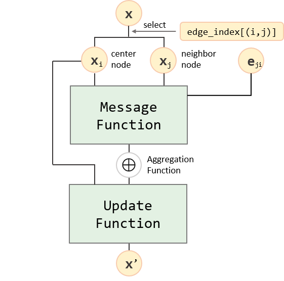
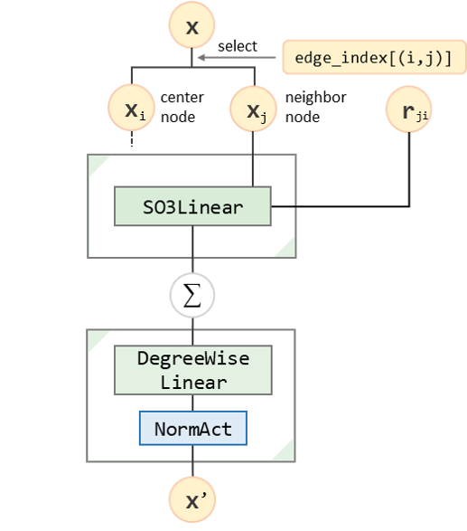

The Fist Equivariant Massage Passing Layer
==========================================

In this section, we will start building our fist equivariant layer, the Tensor Field Network (TFN), from the aspect of message passing neural networks (MPNN) based on the :obj:`torch_geometric.nn.MessagePassing`.

Since our work is based on `pyg <https://pytorch-geometric.readthedocs.io/en/latest/index.html>`_, we strongly recommend the reader not familiar with pyg to read the tutorial for `graph data <https://pytorch-geometric.readthedocs.io/en/latest/get_started/introduction.html>`_ and `message passing neural networks <https://pytorch-geometric.readthedocs.io/en/latest/tutorial/create_gnn.html>`_ of pyg.

Message Passing Neural Networks
-------------------------------

Throughout the past several years, the paradigm of message passing neural networks has become the standard frame work for graph neural networks (GNN). The key process of updating latent node embedding :math:`\mathbf{x}` and edge embedding :math:`\mathbf{e}` to :math:`\mathbf{x}'` can be expressed as   

.. math::
    \mathbf{x}_i'=\gamma\bigg(\mathbf{x}_i,\bigoplus_{j\in\mathcal{N}(i)}\phi\big(\mathbf{x}_i,\mathbf{x}_j,\mathbf{e}_{j;i}\big)\bigg),

where :math:`\phi` is a message function that generate messages from both source node, target node and the edge; :math:`\bigoplus` is a differentiable, permutation-invariant function that aggregates messages from each nodes of the neighbor :math:`\mathcal{N}(i)` and :math:`\gamma` is the update function that computes the new node embeddings considering the current embedding and the aggregated messages. 

In conventional GNNs, the functions above is typically the scalar functions. However, if we are dealing geometric graphs where the nodes and edges contain geometric and physical information like position :math:`\{\mathbf{r}_i\}` and relative position :math:`\{\mathbf{r}_{j,i}\}`, we should should equivariant functions for all the message, aggregation and updating functions to form an equivariant message passsing neural network.

    A general message passing block.

In the context of AI for science tasks, the message passing processes are also interpreted as the "interactions" between particles. Therefore, some work will refer to a message passing layer as an "interaction block".

Tensor Field Networks
---------------------

The Tensor Field Networks (TFN) is one of the earliest works to use spherical tensors for constructing equivariant neural networks. 

A TFN block can be defined as

.. math::
    \mathbf{x}'_i = \sigma\bigg(\tilde{\mathbf{W}}_{\text{DW}}\big(\sum_{j\in\mathcal{N}(i)}\tilde{\mathbf{W}}(\mathbf{r}_{ji})\mathbf{x}_j\big)\bigg),

where :math:`\mathbf{x}_i'` is the output spherical tensor attribute of the :math:`i`'th node, :math:`\mathbf{x}_j` is the input spherical tensor attribute of the :math:`j`'th node in the neighborhood :math:`\mathcal{N}(i)` of node :math:`i`, :math:`\tilde{\mathbf{W}}(\mathbf{r}_{ji})` is a channel-wise SO(3) equivariant linear operation that depends on the relative position vector :math:`r_{ji}` pointing from :math:`j` to :math:`i`, :math:`\tilde{\mathbf{W}}_{\text{DW}}(\cdot)` is a degree-wise linear operation and :math:`\sigma` is a degree-wise norm-activation (see :obj:`~equitorch.nn.NormAct`).

    A TFN block. 
    Note that :math:`\mathbf{x}_i` is not involved in the block. We denote this with dashed line.

From today's perspective, TFN can also be viewed as a type of MPNN, with the key functions defined as follows:

- Message
    
    The message generated from the source (neighbor) node :math:`j` to the target (center) node :math:`i` is defined as the output of an SO(3) linear:

    .. math::
        \mathbf{m}_{ji}=\phi\big(\mathbf{x}_i,\mathbf{x}_j,\mathbf{r}_{ji}\big)=\tilde{\mathbf{W}}(\mathbf{r}_{ji})\mathbf{x}_j,

    where :math:`\mathbf{r}_{ji}` is the relative postion vector, :math:`\tilde{\mathbf{W}}(\mathbf{r}_{ji})` is a channel-wise SO(3) equivariant linear operation whose weights come from an MLP of the edge-length :math:`\|\mathbf{r}_{ji}\|`.            

- Aggregation

    We use summation as the aggregation function
    
    .. math::
        \mathbf{m}_i =\sum_{j\in\mathcal{N}(i)}\mathbf{m}_{ji}

    like most of the conventional GNNs.

- Updating

    The update of a node is defined as a degree-wise linear (self-interaction) and then a norm-activation:

    .. math::
        \mathbf{x}_i'=\gamma(\mathbf{x}_i, \mathbf{m}_{ji})=\sigma(\tilde{\mathbf{W}}_{\text{DW}}(\mathbf{m}_i)).

Based on the :obj:`torch_geometric.nn.MessagePassing`, we can implement a TFN block as follows:

.. code-block:: python

    from torch.nn import SiLU
    from torch_geometric.nn import MessagePassing, MLP
    from equitorch.nn import SO3Linear, DegreeWiseLinear, NormAct

    class TFNBlock(MessagePassing):

        def __init__(self, in_channels, out_channels, edge_weight_hidden, L_in, L_edge, L_out):

            super().__init__(
                node_dim=0, # In Equitorch this is necessary since by default
                            # node_dim is -2 for the features with no spherical channels
                aggr='add', # Use summation for aggregation, which is the default value
            ) 

            self.lin = SO3Linear(L_in, L_edge, L_out, 
                                in_channels, in_channels, 
                                external_weights=True, channel_wise=True)

            self.self_int = DegreeWiseLinear(L_out, L_out, in_channels, out_channels)
            self.act = NormAct(L_out, SiLU(), degree_wise=True, bias=True, channels=out_channels)
            self.weight_producer = MLP([1, edge_weight_hidden, 
                                        self.lin.num_weights * in_channels])

        def forward(self, x, edge_index, sh, edge_len):

            # Generate edge weight from edge length
            weight = self.weight_producer(edge_len).view(-1, *(self.lin.weight_shape))

            # Generate message m_ji and then aggregate by calling message & aggregate functions
            # (the aggregate function are set to summation)
            out = self.propagate(edge_index, x=x, sh=sh, weight=weight)
            
            # Perform self-interaction on the aggregated message
            out = self.self_int(out)
            
            # Activation
            return self.act(out) 

        # x_j: source node feature extracted by x[edge_index[0]]
        # sh: spherical harmonics on the edge
        # weight: weights for SO3Linear
        def message(self, x_j, sh, weight):
            m_ji = self.lin(x_j, sh, lin_weight)
            return m_ji

Tensor Field Networks with SO(2) Linear Operation
-------------------------------------------------

As mentioned in :ref:`linears`, the SO(3) equivariant linear operation can be implemented more efficiently by SO(2) equivariant linear operation and Wigner D matrices. The following code will show how to change to this implementation by modifying just a few lines of code:

.. code-block:: python

    from torch.nn import SiLU
    from torch_geometric.nn import MessagePassing, MLP
    from equitorch.nn import SO3Linear, DegreeWiseLinear, NormAct
    from equitorch.utils import rot_on # +

    class TFNBlock(MessagePassing):

        # - def __init__(self, in_channels, out_channels, edge_weight_hidden, L_in, L_edge, L_out):
        def __init__(self, in_channels, out_channels, edge_weight_hidden, L_in, L_out): # No need for L_edge

            super().__init__(node_dim=0, aggr='add') 

            # - self.lin = SO3Linear(L_in, L_edge, L_out, 
            # -                     in_channels, in_channels, 
            # -                     external_weights=True, channel_wise=True)

            self.lin = SO2Linear(L_in, L_out,                               # +
                                in_channels, in_channels,                   # +
                                external_weights=True, channel_wise=True)   # +

            self.self_int = DegreeWiseLinear(L_out, L_out, in_channels, out_channels)
            self.act = NormAct(L_out, SiLU(), degree_wise=True, bias=True, channels=out_channels)
            self.weight_producer = MLP([1, edge_weight_hidden, 
                                        self.lin.num_weights * in_channels])

        
        # - def forward(self, x, edge_index, sh, edge_len):
        # We no longer need the spherical harmonics of the edge vector
        # Instead, we need the Wigner D's of the rotation that can aligning the 
        # edge vector to the z-axis, on the input and output spaces. 
        # (We assume the Wigner D is transposed on the output space) 
        def forward(self, x, edge_index, D_in, DT_out, edge_len):

            weight = self.weight_producer(edge_len).view(-1, *(self.lin.weight_shape))

            # out = self.propagate(edge_index, x=x, sh=sh, weight=weight)
            out = self.propagate(edge_index, x=x, D_in=D_in, DT_out=DT_out, weight=weight) # +
            
            out = self.self_int(out)
            return self.act(out) 

        
        # - def message(self, x_j, sh, weight):
        def message(self, x_j, D_in, DT_out, weight): # +
            x_j = rot_on(D_in, x_j) # +  
            m_ji = self.lin(x_j, sh, lin_weight)
            m_ji = rot_on(DT_out, m_ji) # + 
            return m_ji

In the code above, we denoted added lines with ":obj:`# +`" and removed lines with ":obj:`# -`" compared to the implementation above. We can see the major modifications include:

- Replace the :obj:`~equitorch.nn.SO3Linear` :obj:`lin` with an :obj:`~equitorch.nn.SO2Linear`.
- Remove the spherical harmonics :obj:`sh` in the forward and message functions and add the Wigner D's :obj:`D_in` and :obj:`DT_out`.
- When computing messages, first rotate :obj:`x_j` by :obj:`D_in` before the SO2Linear and rotate :obj:`m_ji` by :obj:`DT_out` after the SO2Linear.