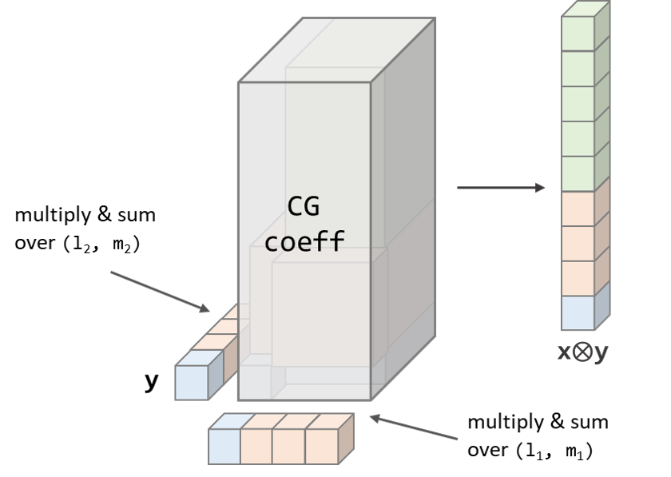
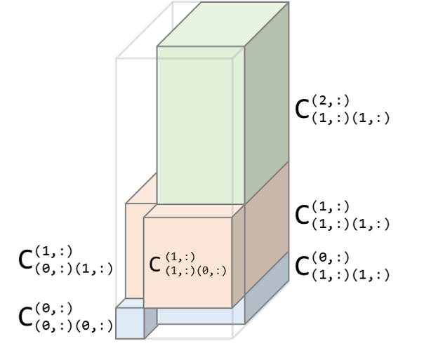
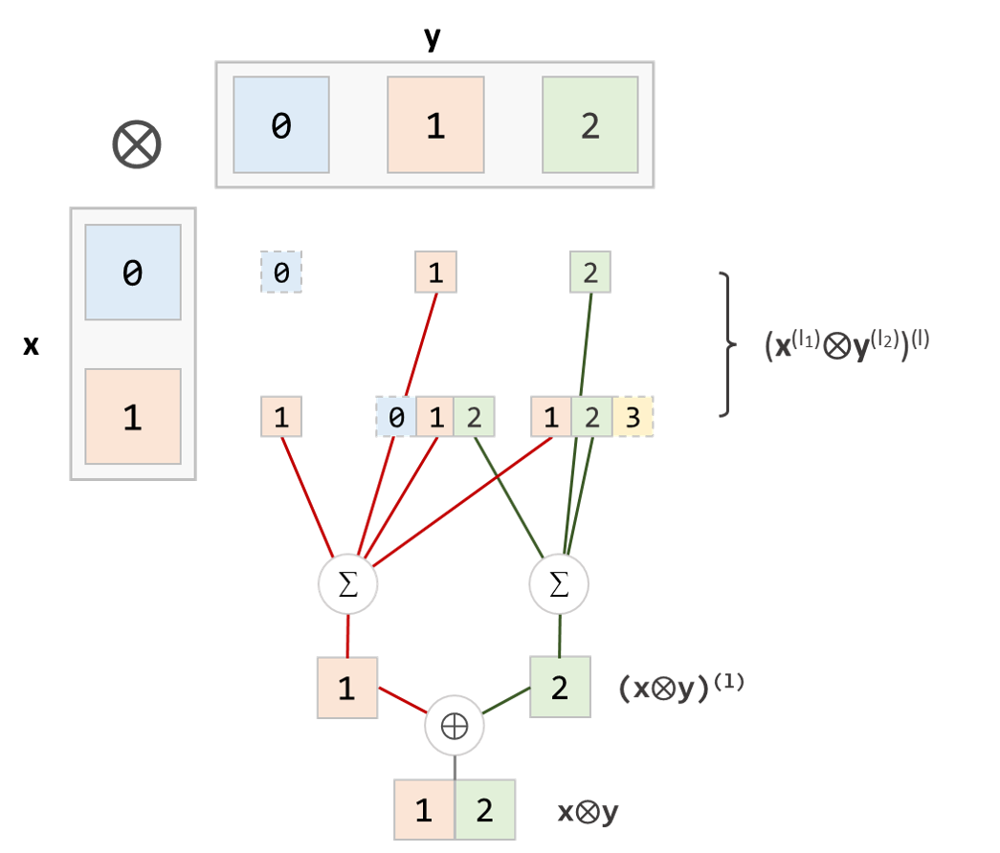
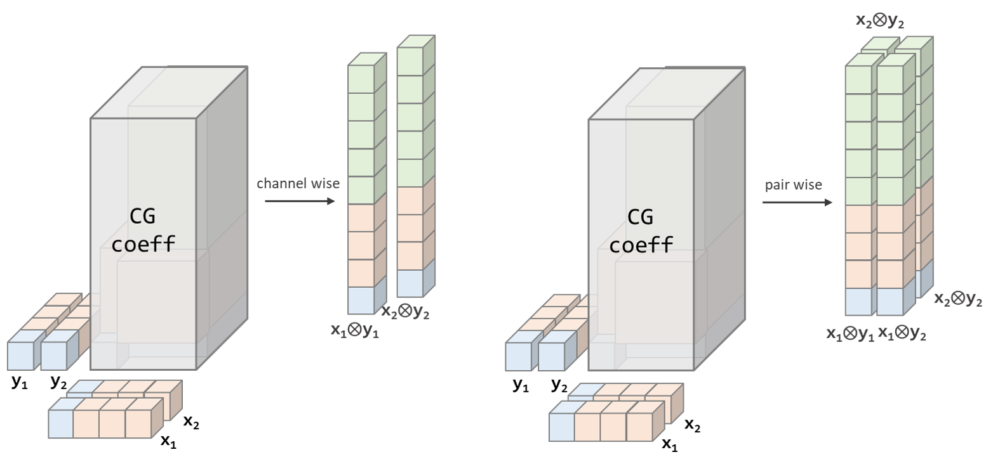
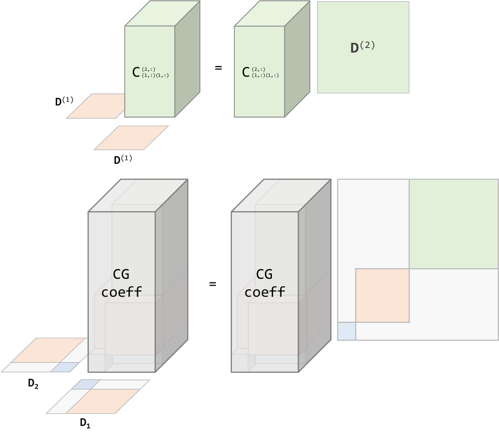
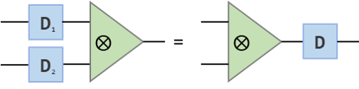
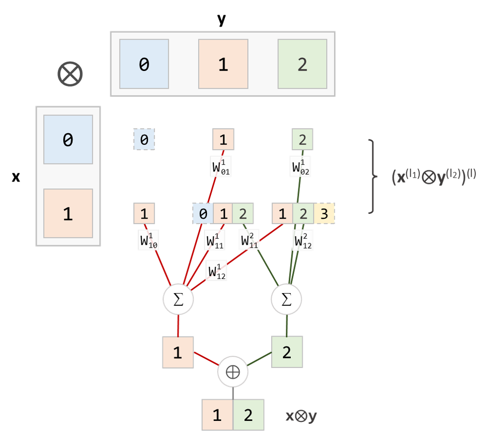
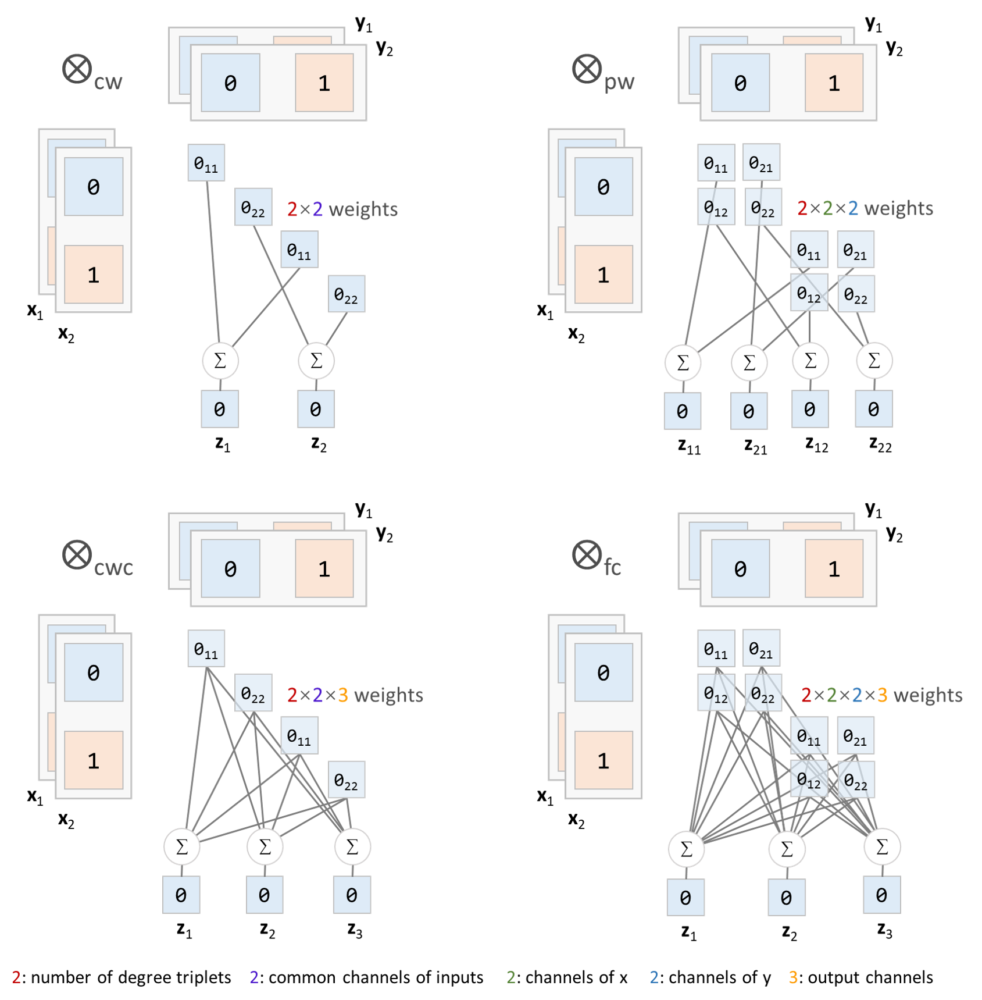
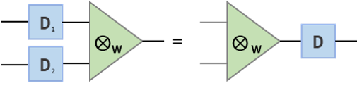

.. _tp:

Tensor Products of Spherical Tensors
====================================

In this section, we will introduce *tensor products*, one of the most fundamental operations for spherical tensors.

.. note::
    While the tensor product forms the foundation of SO(3) linear operations, for those who want to quickly start building an equivariant neural network, you may skip this part and directly read the section on :ref:`linears`.

Tensor Product
--------------

.. note::

    Though the tensor product between spherical tensors originates from cartesian tensor product, but for simplicity, we will not talk too much about the relations here and directly define it as a new operation. 

Given two spherical tensors :math:`\mathbf{x}` and :math:`\mathbf{y}` with degree ranges :math:`L_1` and :math:`L_2`, respectively, the tensor product :math:`\mathbf{x}\otimes \mathbf{y}` of them with the degree range :math:`L_\text{out}` is also a spherical tensor. The each component of the tensor product is defined as the bilinear form

.. math::

    (\mathbf{x}\otimes \mathbf{y})_m^{(l)}=\sum_{(l_1,m_1)}\sum_{(l_2,m_2)}C_{(l_1,m_1)(l_2,m_2)}^{(l,m)}\mathbf{x}_{m_1}^{(l_1)}\mathbf{y}_{m_2}^{(l_2)},\\
    l\in L_{\text{out}}, m=-l,\dots,0,\dots,l.

where :math:`C_{(l_1,m_1)(l_2,m_2)}^{(l,m)}` is the `Clebsch-Gordan coefficients <https://en.wikipedia.org/wiki/Clebsch%E2%80%93Gordan_coefficients>`_ (CG coefficients) that are non-zero only when :math:`|l_1-l_2|\le l\le l_1+l_2`.

    An example of tensor product between two spherical tensors of degree range :math:`(0,1)` to give a spherical tensor of degree range :math:`(0,2)`

If we presents the CG coefficients above in blocks according to input and output degrees, it will look like as follows (all-zero blocks are omitted):

    The blocks of CG coefficients, where ":" represents all the :math:`m`'s from :math:`-l` to :math:`l`.

Splitting the CG coefficients to blocks, we can also write the tensor product as

.. math::
    \mathbf{x}\otimes \mathbf{y}=\bigoplus_{l\in L_{\text{out}}}\sum_{l_1\in L_1,l_2\in L_2}(\mathbf{x}^{(l_1)}\otimes\mathbf{y}^{(l_2)})^{(l)},\\

and

.. math::

    (\mathbf{x}^{(l_1)}\otimes\mathbf{y}^{(l_2)})_{m}^{(l)} = \sum_{m_1=-l_1}^{l_1}\sum_{m_2=-l_2}^{l_2}C_{(l_1,m_1)(l_2,m_2)}^{(l,m)}\mathbf{x}^{(l_1)}_{m_1}\mathbf{y}^{(l_2)}_{m_2}

where :math:`\oplus` is the concatenation and the summation over :math:`(l_1,l_2)` can be restricted to only those degrees with :math:`|l_1-l_2|\le l\le l_1+l_2` (just as the triangular inequality) for the non-zero CG coefficients .

Under this formulation, the tensor product of two spherical tensor of degree range :math:`(0,1)` and :math:`(0,2)`, respectively, to produce a spherical tensor of degree range :math:`(1,2)` can be visualize as follows: 

    The tensor product in blocks .(We represent the components of a single degree by one square with the degree value on it. dashed squares are possible intermediate products, but will not be included in our output.)

The reader can check the triangular inequality of degrees for all the :math:`(\mathbf{x}^{(l_1)}\otimes\mathbf{y}^{(l_2)})^{(l)}`'s above.  

When it comes to multi-channel inputs, we can treat the channels dimension independently to the spherical dimension. In Equitorch, :obj:`~equitorch.nn.TensorProduct` can be used for this operation, where the argument :obj:`channel_wise` is used to specify whether the product is performed channel wise or channel-pair wise. The difference of two settings is shown below:

For example:

.. code-block:: python

    >>> N, C = 5, 3 # Batch-size and channels
    >>> L, L1, L2 = 3, 1, 2 # Maxinum degrees for the output and two inputs
    >>> x = torch.randn(N, num_orders_in(L1), C)
    >>> y = torch.randn(N, num_orders_in(L2), C)
    >>> print(x.shape)
    torch.Size([5, 4, 3])
    >>> print(y.shape)
    torch.Size([5, 9, 3])

    >>> tp = TensorProduct(L1, L2, L, channel_wise=True)
    >>> z = tp(x, y) # channel wise tensor product
    >>> print(z.shape)
    torch.Size([5, 16, 3])

    >>> tp = TensorProduct(L1, L2, L, channel_wise=False)
    >>> z = tp(x, y) # pair wise tensor product
    >>> print(z.shape)
    torch.Size([5, 16, 3, 3])

The Clebsch-Gordan coefficient has such property: for any rotation :math:`\mathbf{R}\in\text{SO(3)}`, we have 

.. math::

    \sum_{m_1',m_2'}C_{(l_1,m_1')(l_2,m_2')}^{(l,m)}\mathbf{D}^{(l_1)}_{m_1,m_1'}(\mathbf{R})\mathbf{D}^{(l_2)}_{m_2,m_2'}(\mathbf{R})=\sum_{m'}\mathbf{D}^{(l)}_{m,m'}(\mathbf{R})C_{(l_1,m_1)(l_2,m_2)}^{(l,m')}\qquad (▲)

    The illustration of the act of the Wigner D's on the CG coefficients.

Thus, we can verify that

.. math::
    [(\mathbf{D}_X(\mathbf{R})\mathbf{x})\otimes (\mathbf{D}_Y(\mathbf{R})\mathbf{y})]=\mathbf{D}(\mathbf{R})(\mathbf{x}\otimes \mathbf{y}),\\

where :math:`\mathbf{D}_X(\mathbf{R})`, :math:`\mathbf{D}_Y(\mathbf{R})` and :math:`\mathbf{D}(\mathbf{R})` are the Wigner D matrices on the spaces of :math:`\mathbf{x}`, :math:`\mathbf{y}` and the output, respectively. This is the equivariance of the tensor product.

    Equivariance of the tensor product.

We can check the equivariances as follows:

.. code-block:: python

    >>> rotations = rand_rotation_angles(N) # Generate N random rotations
    
    >>> D1 = wigner_D(L1, *rotations) # Wigner D on the space of X
    >>> D2 = wigner_D(L2, *rotations) # Wigner D on the space of Y
    >>> D = wigner_D(L, *rotations) # Wigner D on the space of output
    
    >>> x = torch.randn(N, num_orders_in(L1), C)
    >>> y = torch.randn(N, num_orders_in(L2), C)
    
    >>> tp = TensorProduct(L1, L2, L, channel_wise=True)
    
    >>> z = tp(x, y) # Tensor product of original tensors
    >>> z_rotated = tp(rot_on(D1,x), rot_on(D2,y)) # Tensor product of rotated tensors
    
    >>> print(torch.allclose(z_rotated, rot_on(D, z), atol=1e-4)) # Whether the equivariance holds
    True
    >>> print((z_rotated-rot_on(D, z)).abs().max())
    tensor(2.3842e-05)

.. _wtp:

Weighted Tensor Product
--------------------------

From the equivariance property :math:`(▲)` of Clebsch-Gordan coefficients, we can see that, in the tensor product operation

.. math::
    \mathbf{x}\otimes \mathbf{y}=\bigoplus_{l}\sum_{l_1\in L_1,l_2\in L_2}(\mathbf{x}^{(l_1)}\otimes\mathbf{y}^{(l_2)})^{(l)},
the equivariances are actually preserved per-degree triplets :math:`(l,l_1,l_2)`. Therefore, weighting between the intermediate tensor products :math:`(\mathbf{x}^{(l_1)}\otimes\mathbf{y}^{(l_2)})^{(l)}` of different degree triplets before summing up do not violate the equivariances. Thus, it comes to the weighted tensor product

.. math::
    \mathbf{x}\otimes_{\mathbf{W}} \mathbf{y}=\bigoplus_{l}\sum_{l_1\in L_1,l_2\in L_2}\mathbf{W}_{l_1,l_2}^{l}(\mathbf{x}^{(l_1)}\otimes\mathbf{y}^{(l_2)})^{(l)},

where the number of weights should be consistent with the number of degree triplets that statisfies :math:`|l_1-l_2|\le l\le l_1+l_2` (which can be obtained by :obj:`~equitorch.utils.num_degree_triplets`).

Here we give an example of weighted tensor product of of two spherical tensor of degree range :math:`(0,1)` and :math:`(0,2)` to produce a spherical tensor of degree range :math:`(1,2)`.  

Again, when considering multi-channel inputs, the channel dimensions can still be treated independently to the spherical dimensions. In Equitorch, :obj:`~equitorch.nn.WeightedTensorProduct` can be used for this operation. The behaviour on the channel dimensions can be specified by the options :obj:`channel_wise` and :obj:`connected`. :obj:`channel_wise` speicifies whether the channels of inputs get combined on the same position (channel-wise) or on all pairs; while :obj:`connected` speicifies whether the combined input channels are then mixed to get the output channels. Correspondingly, we also provide four types, :obj:`channel_wise` (:obj:`cw`), :obj:`pair_wise` (:obj:`pw`), :obj:`channel_wise_connected` (:obj:`cwc`) and :obj:`fully_connected` (:obj:`fc`) for different combinations of the two options. 

Here we list the correspondance and the constraints on the number of channels:

+---------------------+------------------+-------------------------------+-------------------------------------+
| :obj:`channel_wise` | :obj:`connected` | :obj:`tp_type`                | Shape constraints                   |
+=====================+==================+===============================+=====================================+
| :obj:`True`         | :obj:`False`     | :obj:`channel_wise`           | :math:`C_{\text{out}}=C_1=C_2`      |
+---------------------+------------------+-------------------------------+-------------------------------------+
| :obj:`False`        | :obj:`False`     | :obj:`pair_wise`              | :math:`C_{\text{out}}=C_1\cdot C_2` |
+---------------------+------------------+-------------------------------+-------------------------------------+
| :obj:`True`         | :obj:`True`      | :obj:`channel_wise_connected` | :math:`C_1=C_2`                     |
+---------------------+------------------+-------------------------------+-------------------------------------+
| :obj:`False`        | :obj:`True`      | :obj:`fully_connected`        | No constraints                      |
+---------------------+------------------+-------------------------------+-------------------------------------+

The figure below illustrates how the channel dimensions are treated under the four settings.

    An example of weighted tensor product for two inputs of degree range :math:`(0,1)` with two channels to the output of degree :math:`0`. ":math:`0_{c_1c_2}`" means the intermediate tensor products :math:`(\mathbf{x}_{c_1}^{(l_1)}\otimes \mathbf{y}_{c_2}^{(l_2)})^{(0)}`. 

In some models, the weight used in weighted tensor products can be data-dependent. We use another option :obj:`external_weights` to specify such cases. The shape of weight needed can be obtained by the attribute :obj:`weight_shape`.

The code below shows the usage of weighted tensor product of type :obj:`channel_wise` and :obj:`fully_conneceted`.

.. code-block:: python

    >>> N, C = 3, 3 # Batch-size and channels
    >>> L, L1, L2 = 5, 2, 3 # Maxinum degrees for the output and two inputs
    >>> x = torch.randn(N, num_orders_in(L1), C)
    >>> y = torch.randn(N, num_orders_in(L2), C)
    >>> print(x.shape)
    torch.Size([5, 4, 3])
    >>> print(y.shape)
    torch.Size([5, 9, 3])

    >>> wtp = WeightedTensorProduct(L1, L2, L, 
    >>>                         in1_channels=C,
    >>>                         in2_channels=C,
    >>>                         channel_wise=True, connected=False)
    >>> print(wtp.num_weights, wtp.weight_shape)
    10 (10, 3)
    >>> z = wtp(x, y) # channel wise weighted tensor product
    >>> print(z.shape)
    torch.Size([5, 16, 3])

    >>> wtp = WeightedTensorProduct(L1, L2, L, 
    >>>                         in1_channels=C, 
    >>>                         in2_channels=C,
    >>>                         out_channels=7, 
    >>>                         tp_type='fc', external_weights=True)
    >>> print(wtp.num_weights, wtp.weight_shape)
    10 (10, 3, 3, 7)
    >>> W = torch.randn(N, *(wtp.weight_shape))
    >>> z = wtp(x, y, W) # fully connected tensor product using external weights
    >>> print(z.shape)
    torch.Size([5, 16, 7])

Similarly, the weighted tensor product is also an equivariant operation such that

.. math::
    [(\mathbf{D}_X(\mathbf{R})\mathbf{x})\otimes_{\mathbf{W}} (\mathbf{D}_Y(\mathbf{R})\mathbf{y})]=\mathbf{D}(\mathbf{R})(\mathbf{x}\otimes_{\mathbf{W}} \mathbf{y}),\\

where :math:`\mathbf{D}_X(\mathbf{R})`, :math:`\mathbf{D}_Y(\mathbf{R})` and :math:`\mathbf{D}(\mathbf{R})` are the Wigner D matrices on the spaces of :math:`\mathbf{x}`, :math:`\mathbf{y}` and the output, respectively.

    Equivariance of the tensor product.

The code below checks the equivariances for fully connected tensor products:

.. code-block:: python

    >>> rotations = rand_rotation_angles(N) # Generate N random rotations

    >>> D1 = wigner_D(L1, *rotations) # Wigner D on the space of X
    >>> D2 = wigner_D(L2, *rotations) # Wigner D on the space of Y
    >>> D = wigner_D(L, *rotations) # Wigner D on the space of output

    >>> x = torch.randn(N, num_orders_in(L1), C)
    >>> y = torch.randn(N, num_orders_in(L2), C)

    >>> wtp = WeightedTensorProduct(L1, L2, L, 
    >>>                         in1_channels=C, 
    >>>                         in2_channels=C,
    >>>                         out_channels=7, 
    >>>                         tp_type='fc', external_weights=True)
    >>> W = torch.randn(N, *(tp.weight_shape))
    >>> z = wtp(x, y, W) # Weighted tensor product of original tensors
    >>> z_rotated = wtp(rot_on(D1,x), rot_on(D2,y), W) # Weighted tensor product of rotated tensors

    >>> print(torch.allclose(z_rotated, rot_on(D, z), atol=1e-4)) # Check whether the equivariance holds
    True
    >>> print((z_rotated-rot_on(D, z)).abs().max())
    tensor(7.3552e-05)

The reader can check the equivariances similarly for the remaining three cases.
